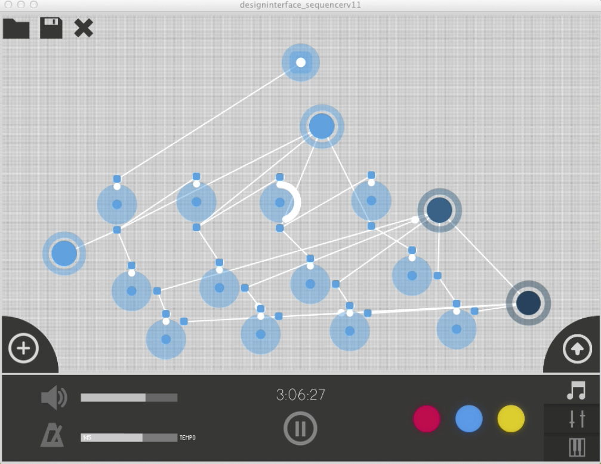

DandelionProject
================

a graphic musical sequencer

An app I made for my Interface Design course

This is a terribly written, and all in Processing sequencer app. Basically all nodes can delay and transfert a signal to "sound nodes" that make a sound. 

It is a wonder this runs at all! 

More info on the PDF. 

(click image for video)
